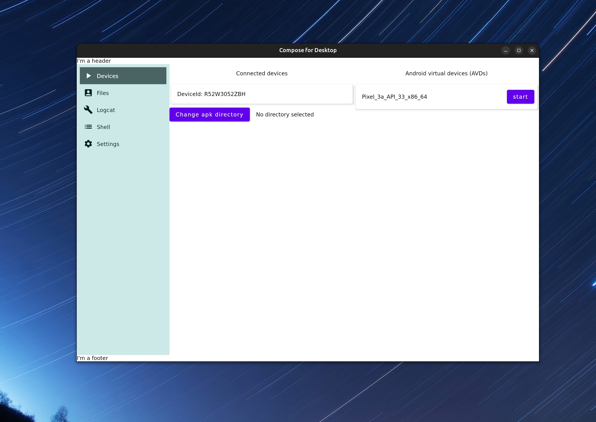

# adb-desktop
Using the new jetpack compose

## What

Creating a simple desktop application to control devices with adb. Looking to use 
this to measure Android application performance.

Right now, you can manage adb wireless connections.

## Development

https://www.jetbrains.com/lp/compose/

1. Open with Intellij
2. Go to gradle, compose desktop, run



## Distribution

This command is what we are looking for. But it does not work. It seems to be an issue that will be resolved in java 19 https://github.com/JetBrains/compose-jb/issues/1666#issuecomment-1011289874.

```
./gradlew createDistributable
```

I couldn't update yet because it seems jetpack compose does not yet support it.

So we can make a jar for now
```
./gradlew packageUberJarForCurrentOS
java -jar build/compose/jars/adb-desktop-linux-x64-1.0.0.jar
```

You can also run with this
```
./gradlew run
```
